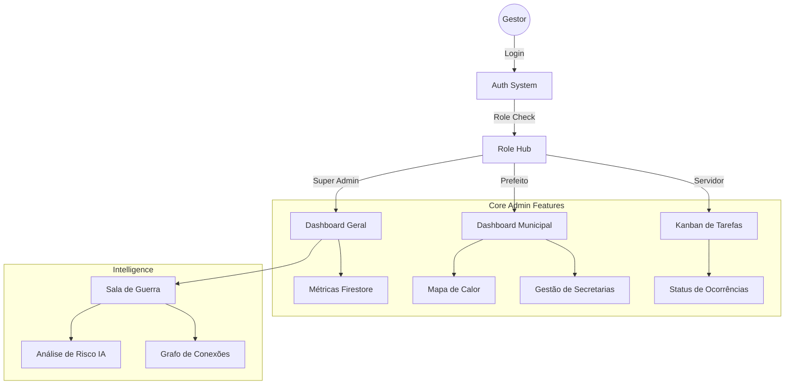

# Guardião Nacional - Painel Administrativo


Painel de administração exclusivo servido em `painel.guardiaonacional.com`. Permite o gerenciamento de ocorrências e serviços municipais.

## 🏗️ Arquitetura e Fluxo



## 🚀 Funcionalidades Principais

### Gestão e Monitoramento
- **Multi-nível**: Brasil > Estado > Município.
- **Kanban**: Gestão visual de ocorrências (A Fazer, Em Andamento, Concluído).
- **CRM**: Gestão de servidores e secretarias municipais.

### Inteligência (Sala de Guerra)
- **Análise de Risco**: Monitoramento de estabilidade política via IA.
- **Grafo de Conexões**: Visualização de relacionamento entre entidades.

### Controle do Sistema
- **Webhooks**: Integração com sistemas externos (CRM, ERPs Municipais).
- **Security Rules 2.0**: Controle granular de acesso por nível de cidade e função.
- **Insights Preditivos**: Alertas automáticos de "Hotspots" e tendências de problemas.
- **Auto-Moderação**: Filtros de IA para conteúdo impróprio com limiar de auto-publicação otimizado (Risco ≤ 3).
- **Auditoria**: Logs detalhados de ações administrativas.
- **Dashboard Estratégico**: Visão nacional com métricas de aprovação, resolução e tendências temporais.
- **Otimização de Heatmap**: Novo motor de renderização no IntelligenceMap com limite de 2000 pontos e ajuste dinâmico de intensidade para hotspots.

## 🛠️ Stack Tecnológico

| Camada | Tecnologia |
|--------|------------|
| **Frontend** | React 19, Vite 5, TypeScript |
| **Estilização** | Tailwind CSS v4, Shadcn/UI |
| **Gráficos** | Recharts, React Force Graph |
| **Backend** | Firebase (Auth, Firestore, Hosting) |
| **Testes** | Playwright (E2E), Vitest (Unit) |

## 📦 Instalação

```bash
# 1. Clone o repositório
git clone https://github.com/manuelportelaneto/procuradoria-cidada-painel.git

# 2. Instale dependências
npm install

# 3. Configure .env
cp .env.example .env

# 4. Inicie
npm run dev
```

## 🧪 Testes

O projeto possui cobertura de testes unitários e E2E.

```bash
# Unitários
npm run test

# Segurança
npm run test:security

# E2E (Playwright)
npm run test:e2e
```

---
**Desenvolvido por Cloud Matrix**
