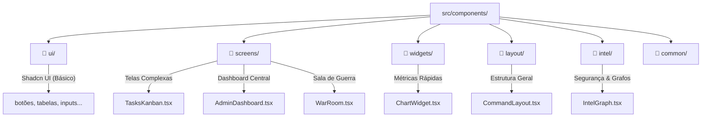

# 📂 Guia de Componentes Visuais (`guardiao-painel/src/components`)

Este diretório abriga todos os blocos de construção visual e as telas completas que estruturam o Painel Administrativo. Ele separa a apresentação em categorias bem definidas para garantir legibilidade, manutenibilidade e alta performance.

---

## 🗺️ Mapa de Responsabilidades dos Subdiretórios

### 1. 📂 [ui/](file:///home/ubuntu/Documents/Projetos/guardiao/guardiao-painel/src/components/ui/)
Blocos de interface atômicos criados com base nas diretrizes do **Shadcn UI** e customizados para o Guardião (botões, modais, tabelas, caixas de diálogo, inputs, select).
* **Finalidade**: Manter a consistência visual de tipografia, espaçamento e acessibilidade do design system.

### 2. 📂 [screens/](file:///home/ubuntu/Documents/Projetos/guardiao/guardiao-painel/src/components/screens/)
As telas principais da aplicação que representam as páginas completas de administração municipal:
* 🎛️ **[AdminDashboard.tsx](file:///home/ubuntu/Documents/Projetos/guardiao/guardiao-painel/src/components/screens/AdminDashboard.tsx)**: Visão geral da saúde urbana com contagem de chamados, taxa de resolução e alertas de picos.
* 📋 **[TasksKanban.tsx](file:///home/ubuntu/Documents/Projetos/guardiao/guardiao-painel/src/components/screens/TasksKanban.tsx)**: Kanban de zeladoria urbana para mover ocorrências entre "Aprovado", "Em Execução" e "Concluído".
* 🪖 **[WarRoom.tsx](file:///home/ubuntu/Documents/Projetos/guardiao/guardiao-painel/src/components/screens/WarRoom.tsx)**: Sala de Guerra para monitoramento ao vivo de incidentes graves de segurança pública, contendo chats de rádio e inteligência sintética.
* 🤖 **[ActionEngine.tsx](file:///home/ubuntu/Documents/Projetos/guardiao/guardiao-painel/src/components/screens/ActionEngine.tsx)**: Central de inteligência preditiva que sugere rotas e otimização de equipes de limpeza urbana baseada em IA.
* ⚡ **[GraalIngest.tsx](file:///home/ubuntu/Documents/Projetos/guardiao/guardiao-painel/src/components/screens/GraalIngest.tsx)**: Canalizadores de ingestão e parse automático de relatórios municipais legados de engenharia civil.

### 3. 📂 [intel/](file:///home/ubuntu/Documents/Projetos/guardiao/guardiao-painel/src/components/intel/)
Componentes voltados especificamente para a ala de inteligência administrativa:
* 🌐 **[IntelGraph.tsx](file:///home/ubuntu/Documents/Projetos/guardiao/guardiao-painel/src/components/intel/IntelGraph.tsx)**: Exibição interativa de redes complexas e conexões de risco entre denúncias e localidades.
* 🚨 **[ThreatGauge.tsx](file:///home/ubuntu/Documents/Projetos/guardiao/guardiao-painel/src/components/intel/ThreatGauge.tsx)**: Marcador visual de nível de perigo e vulnerabilidade territorial municipal.

### 4. 📂 [widgets/](file:///home/ubuntu/Documents/Projetos/guardiao/guardiao-painel/src/components/widgets/)
Cards e painéis de dados rápidos embutíveis (Gráficos Recharts, listagem rápida de ocorrências recentes, painel de insights descritivos por IA).

### 5. 📂 [layout/](file:///home/ubuntu/Documents/Projetos/guardiao/guardiao-painel/src/components/layout/)
Estruturas envolventes globais (ex: `CommandLayout.tsx` contendo a navegação lateral e cabeçalho administrativo unificado).

### 6. 📂 [common/](file:///home/ubuntu/Documents/Projetos/guardiao/guardiao-painel/src/components/common/)
Componentes compartilhados como filtros de localização padronizados e caixas de diálogo gerais de confirmação.
